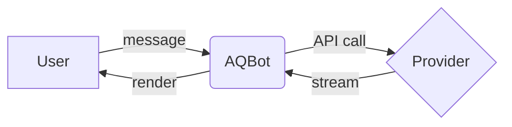

AQBot renders AI responses as rich content rather than plain text. Code blocks open in a full Monaco editor with syntax highlighting and diff preview. Mathematical expressions render with LaTeX. Diagrams described in Mermaid or D2 notation are drawn as interactive visuals. Longer outputs such as HTML drafts, reports, and standalone code snippets appear in a dedicated **Artifact** panel so they do not crowd the conversation thread.

## Supported content types

| Content type | How it is rendered |
|---|---|
| Markdown (headings, bold, italic, lists, links) | Native Markdown renderer |
| Fenced code blocks | Monaco Editor with syntax highlighting, copy button, diff preview |
| LaTeX math (inline and block) | KaTeX math renderer |
| Tables | Styled HTML table |
| Task lists (`- [ ]` / `- [x]`) | Interactive checkboxes |
| Mermaid diagrams | Mermaid renderer (flowcharts, sequence diagrams, Gantt charts, etc.) |
| D2 diagrams | D2 renderer (architecture and relationship diagrams) |
| HTML drafts, Markdown notes, reports, code snippets | Artifact panel |

## Monaco code editor

Every fenced code block in a response is displayed inside an embedded **Monaco Editor** instance — the same editor that powers Visual Studio Code. This gives you:

- Full syntax highlighting for all major languages
- A **Copy** button to copy the block content to your clipboard with one click
- A **Diff preview** view to compare the original and a modified version of the same code block

## Diagrams

You can ask AQBot to produce a diagram by describing it in natural language. The model generates the diagram source and AQBot renders it immediately below the code fence.

### Mermaid example

````

````

### D2 example

````
```d2
direction: right
User -> AQBot: message
AQBot -> Provider: API call
Provider -> AQBot: stream
AQBot -> User: render
```
````

## LaTeX math

Wrap inline math in single dollar signs and block math in double dollar signs. AQBot renders both with KaTeX.

**Inline example** (type in the chat input):

```
The quadratic formula is $x = \frac{-b \pm \sqrt{b^2 - 4ac}}{2a}$.
```

**Block example:**

```
$$
\int_{-\infty}^{\infty} e^{-x^2} dx = \sqrt{\pi}
$$
```

## Artifact panel

When a response contains a self-contained artifact — an HTML page, a standalone script, a Markdown document, or a report — AQBot opens it in a side panel instead of embedding it inline. The **Artifact** panel provides:

- A rendered preview (HTML is displayed in a sandboxed frame; Markdown is rendered)
- A raw source view for copying or editing
- A fullscreen toggle for larger outputs

Artifacts are associated with the message that produced them and persist for the lifetime of the conversation.

## Voice chat

<Note>
  Real-time voice chat is **coming soon**. AQBot will support WebRTC-based voice conversations using the OpenAI Realtime API, allowing you to speak directly to the model and hear its responses without typing.
</Note>
